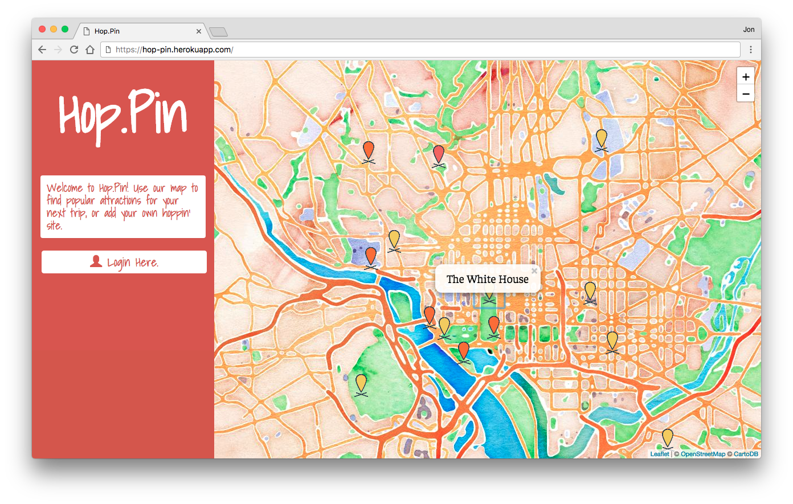
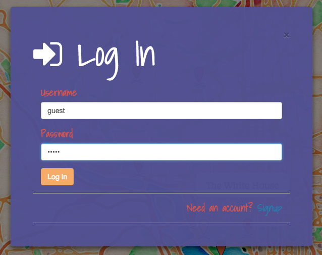
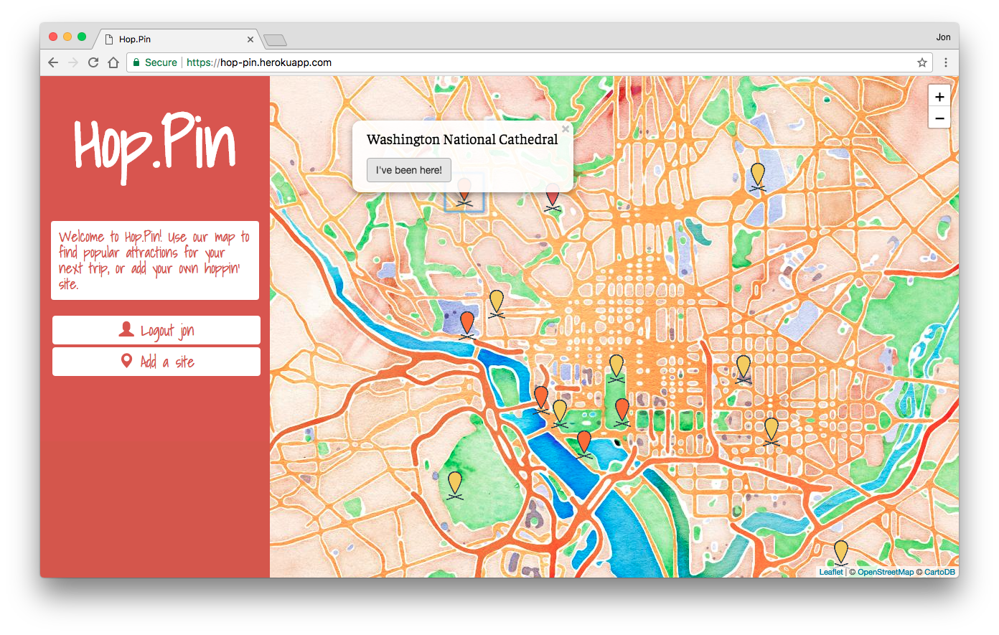
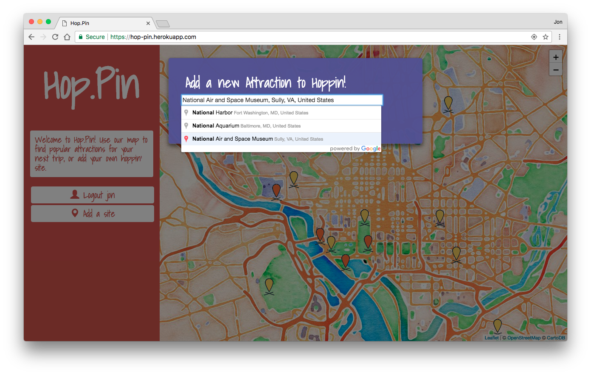

# Hop.Pin
Hop.Pin is the fastest and easiest way to see what's cool to do at your destination. A live version can be viewed at https://hop-pin.herokuapp.com/

## Description

Traveling to a new destination and unsure what to do while there? Or looking to find what else is hip in your area? Hop.Pin allows you to quickly and easily see the most popular attractions in an area. Each destination is represented by a pin on the map, with the pin's color representing how many users have logged their visit there in the past year. Clicking on a pin brings up a small bubble with the name of that desintation, with users being able to mark that they have been there before.

Hop.Pin also allows users to create their own personal accounts so they can track their location history by registering visits. User login and signup is handled locally via Passport.js, with password encryption using Bcrypt. Once logged in, users can mark that they have visited an attraction, as well as add new attractions using the Google Maps Autocomplete API.

Hop.Pin differentiates itself from other platforms like Yelp and Google Maps by how quick and easy it is to use. Rather than having to slog through review after review, users can quickly judge which destinations truly are the most popular and slim down their search from there.

Currently, Hop.Pin only contains destinations from the Washington, D.C. area but supports the addition of locations worldwide by users as long as they are registered in the Google Maps API.

## Development

This app was developed by Anastasia Marks, James Webber, Jon Christensen, and Will Tarkenton as the second group project of the GW Coding Bootcamp. It was built using HTML5, CSS3 with Bootstrap, Javascript, jQuery, Node, Express, Handlebars, and Sequelize. It also features Passport.js and Leaflet.js. For more information on these two technologies, please see http://passportjs.org/ and http://leafletjs.com/

### Future Developments
While Hop.Pin is a completed project, there were many additional features we thought of that could be added on.

	Attraction information - display basic information about each attraction in their pin's bubble
	Relative popularity - adjust pin colors relative to other attractions visible at that time. Additionally, limit visible pins to only the most popular ones as the user zooms out
	Color Scale - add the capability to temporarily swap the color scale to reflect average user rating instead of overall popularity
	Categories - include attraction category to allow users to quickly filter the types that appeal most to them
	User profiles & recommendation - track user demographics to isolate trends and patterns and offer recommendations to users
	Mobile device apps - optimize Hop.Pin for users on the go by putting it on their phones. With mobile apps Hop.Pin can take care of the manual work out by automatically adding users' visits to a destination
	Big Data - as Hop.Pin grows larger and larger so do the possible applications with big data

## Screenshots
### Hop.Pin Main Page

### Log In Modal

### Marking a Visit to the National Cathedral

### Adding the National Air and Space Museum

